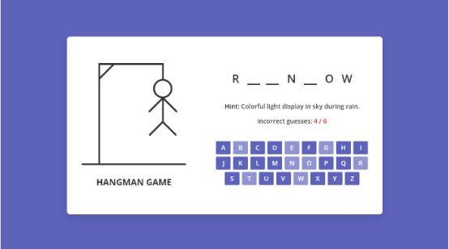

# Hangman:

**HTML/CSS**:

**Left section**: Picture section to display images, change image by each error.

**Right section**: top the word in letters hidden.

- letters (hide and show) in `<li>`
- Hint `<p>`
- User lives `<p>`
- Alphabet buttons `<buttons>`s

  For faster design i will use bootstrap



## JavaScript :

Here are the steps the programme will take to achieve the goal

**Note:** the code had been added after programme completion.

0. Have a list of words with the hint in array format with {word, hint} objects inside.

1. when page load a (word, hint) will get selected randomly from the list and add it to the starting function. get the hint form list and add it to paragraph.

```
const getRandomWord = () => {
  //will be called by page start or play again button
  // getting word and hint form the list
  const { word, hint } = wordList[Math.floor(Math.random() * wordList.length)];

  currentWord = word;
  hintText.innerText = hint;
  resetGame();
};
```

2. make a list of keyboard buttons with the alphabet letters and display the hint

```
for (let i = 97; i <= 122; i++) {
  const button = document.createElement("button");
   //this will git number value and change it to letters
  button.innerText = String.fromCharCode(i);
  keyboardDiv.appendChild(button);
  let btnClasses = [
    "btn",
    "btn-primary",
    "m-1",
    "text-white",
    "text-uppercase",
  ];
  button.classList.add(...btnClasses);
  button.addEventListener("click", (e) =>
    initGame(e.target, String.fromCharCode(i))
  );
}
```

3. setting the default image displaying guesses making the top list(hidden)

```
const resetGame = () => {
  //  on page start or play agin button will be called and set every thing to default
  correctLetters = [];
  wrongGuessCount = 0;
  hangmanImage.src = "images/hangman-0.svg";
  gussesstext.innerText = `${wrongGuessCount} / ${maxGuesses}`;
  worddysplay.innerHTML = currentWord
    .split("")
    .map(() => `<li class='letter'></li>`)
    .join("");
  console.log(currentWord);

  //when clicked will get disabled
  keyboardDiv
    .querySelectorAll("button")
    .forEach((btn) => (btn.disabled = false));
};
```

4. if the user clicked a letter check if there is a similar letter in the selected word if yes display the letter in the word section and disable the button letter

```
const initGame = (button, clickedLetter) => {
  //check if clickedletter is exist on the currentWord
  if (currentWord.includes(clickedLetter)) {
    [...currentWord].forEach((letter, index) => {
      // look in the currentword
      if (letter === clickedLetter) {
        // check if there is same letter in it
        correctLetters.push(letter);
        worddysplay.querySelectorAll("li")[index].innerText = letter;
        worddysplay.querySelectorAll("li")[index].classList.add("guessed");
      }
    });
  }
```

5. if the user clicked the letter and there is not letter similar in the word minis the live the use have, change the hero image

```
 else {
  // if clicked letter dose not exist then update the wrongGuestcount and hangman image
  wrongGuessCount++;
  hangmanImage.src = `images/hangman-${wrongGuessCount}.svg`;
}
button.disabled = true;
gussesstext.innerText = `${wrongGuessCount} / ${maxGuesses}`;
```

6.  if the user run out of lives show a message with the correct word

```
// calling gameover function if any of these condition meets
if (wrongGuessCount === maxGuesses) return gameOver(false);
if (correctLetters.length === currentWord.length) return gameOver(true);
};

```

7. message prompt with bootstrap modal and try again button

```
const gameOver = (isVictory) => {
  // After game complete.. showing modal with relevant details
  const modalText = isVictory ? `You found the word:` : "The correct word was:";
  gameModal.querySelector("img").src = `images/${
    isVictory ? "victory" : "lost"
  }.gif`; // if statement change the image based on the
  gameModal.querySelector("h4").innerText = isVictory
    ? "Congrats!"
    : "Game Over!";
  gameModal.querySelector("p").innerHTML = `${modalText} <b>${currentWord}</b>`;
  const helpMessage = document.createElement("p");
  helpMessage.innerText = "check Inspect if you need help";
  gameModal.classList.add("show");
  myModal.show();
};
```

8.  when the page restarts select a new word,hint and start from 1

```
getRandomWord();
playAgain.addEventListener("click", getRandomWord);
```
